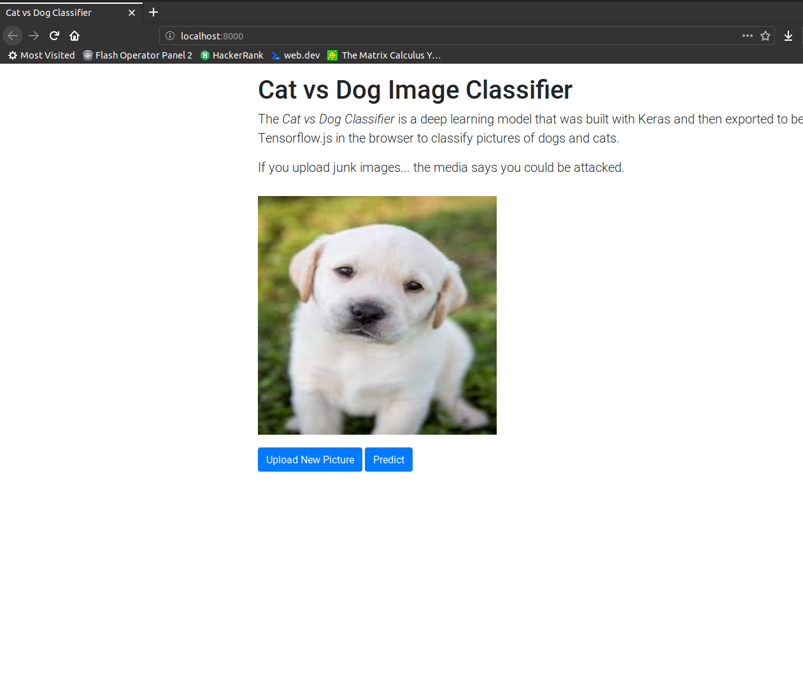

# Cat vs Dog Image Classifier with Tensorflow.js
Classify a dog or cat image inside any browser. The classifier uses a pre-trained model built with Keras that was then exported to Tensorflow.js. Click [here](https://cat-vs-dogs-3afcc.firebaseapp.com/) to try it yourself.

 

## Getting Started
- `git clone https://github.com/dkreider/tensorflowjs-cat-vs-dog.git `
- `cd tensorflowjs-cat-vs-dog`
- `python3 -m http.server`
- Open your browser to [localhost:8000](http://localhost:8000/)

## Built With

* [Tensorflow.js](https://www.tensorflow.org/js)
* [Keras](www.keras.io)
* [Twitter Bootstrap](http://getbootstrap.com/)

## License

This project is licensed under the MIT License - see the [LICENSE.md](LICENSE.md) file for details

